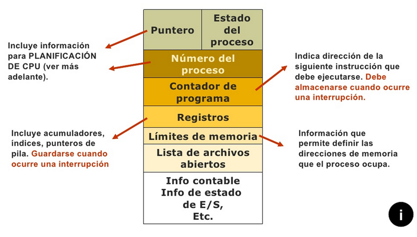
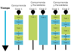
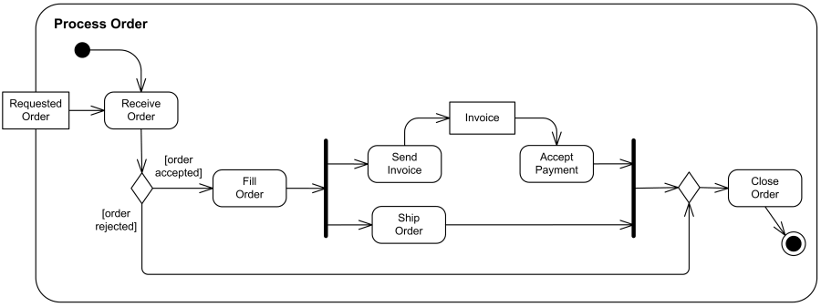

# Tema 1 - Programación concurrente

Este contenido de [Apuntes de PSP](https://psp2dam.github.io/psp_pages/es/) ha sido creado por Vicente Martínez está bajo una licencia CC `BY-NC-SA 4.0` – [Attribution-NonCommercial-NoDerivatives](https://github.com/idleberg/Creative-Commons-Markdown/blob/master/4.0/by-nc-nd.markdown) y ha sido adaptado para su uso en esta plataforma educativa por Manuel C. Piñeiro Mourazos.

Los cambios realizados pueden incluir incorporación de nuevos contenidos, corrección de errores, etc. Si encuentras algún error o tienes alguna sugerencia, no dudes en ponerte en contacto conmigo.

En los lugares donde haya procedido se ha substituido el código fuente original en Java por código Go.

<!-- toc -->

- [Introducción](#introduccion)
    * [Objetivos](#objetivos)
- [Procesos programas e hilos](#procesos-programas-e-hilos)
    * [Procesos y programas](#procesos-y-programas)
    * [Programación concurrente](#programacion-concurrente)
        + [Utilidad de la programación concurrente](#utilidad-de-la-programacion-concurrente)
        + [Comunicación y sincronización entre procesos](#comunicacion-y-sincronizacion-entre-procesos)
    * [Servicios e hilos](#servicios-e-hilos)
        + [Programa secuencial (Arquitectura Von Neumann)](#programa-secuencial-arquitectura-von-neumann)
        + [Programa concurrente (multihilo)](#programa-concurrente-multihilo)
        + [Hilos vs procesos](#hilos-vs-procesos)
            - [Procesos](#procesos)
            - [Hilos](#hilos)
        + [Servicios](#servicios)
- [Concurrencia](#concurrencia)
    * [Concurrencia vs Paralelismo](#concurrencia-vs-paralelismo)
        + [Monoproceso](#monoproceso)
        + [Multiprogramación](#multiprogramacion)
        + [Paralelismo](#paralelismo)
    * [Sistemas distribuidos](#sistemas-distribuidos)
    * [Ventajas e inconvenientes](#ventajas-e-inconvenientes)
        + [del procesamiento en paralelo](#del-procesamiento-en-paralelo)
        + [de la programación distribuida](#de-la-programacion-distribuida)
    * [Condiciones de Bernstein](#condiciones-de-bernstein)
- [Procesos en el SO](#procesos-en-el-so)

<!-- tocstop -->

## Introducción

En este primer tema vamos a conocer los conceptos básicos relacionados con la programación concurrente, así como la mayoría de la terminología que vamos a utilizar durante todo el curso.

Son muchas las tareas que requieren de un procesamiento rápido de cantidades ingentes de datos. Un par de ejemplos los tenemos en las aplicaciones Big Data e Inteligencia artificial. Estos dos campos son unos de los máximos exponentes en cuanto a programación concurrente.

### Objetivos

Los objetivos que alcanzaremos tras esta unidad son:

- Diferenciar entre programa y proceso.
- Comprender qué es la concurrencia.
- Conocer el concepto, diferencias y relación existente entre las dos unidades básicas de ejecución: procesos e hilos.
- Tener nociones sobre programación concurrente.
- Entender el funcionamiento concurrente del SO y del hardware.

## Procesos programas e hilos

### Procesos y programas

Un programa no es más que un conjunto de instrucciones u órdenes que le indican a un dispositivo qué acciones debe realizar con los datos recibidos. La única diferencia entre un programa y un algoritmo es que el programa está creado para que pueda ser ejecutado por un ordenador.

Un proceso es un programa en ejecución. Esto es, un proceso es una entidad activa y un programa es una entidad pasiva.

El proceso, por tanto, está representado por el contador del programa, el valor de los registros, la pila, el código ejecutable, su estado, etc. todo lo necesario para la ejecución del programa por parte del SO. Esta estructura se conoce como PCB (Process Control Block).

Cada proceso es una entidad independiente. Cuando un programa se ejecuta, el sistema operativo crea un proceso. Si ese mismo programa se vuelve a ejecutar, se crearía un proceso distinto, teniendo en memoria dos instancias del mismo programa. Pero es importante recalcar que los dos procesos son independientes.

### Programación concurrente

Podemos decir que dos procesos son concurrentes cuando **la primera instrucción de uno de los procesos se ejecuta después de la primera y antes de la última** de otro proceso.

Esta ejecución concurrente puede alcanzarse de dos formas:

- Mediante la **multiprogramación**. En este caso, el SO asigna a cada proceso un intervalo de tiempo (quantum) para su ejecución. Cuando se agota ese intervalo, el SO interrumpe la ejecución del proceso y cede el control a otro proceso. De esta forma, aunque en realidad sólo se está ejecutando un proceso en cada instante de tiempo, la alternancia entre los procesos da la sensación de que se están ejecutando simultáneamente.
- Mediante la **multiprocesamiento**. En este caso, el sistema dispone de varios procesadores (o núcleos) y cada uno de ellos puede ejecutar un proceso distinto en cada instante de tiempo. De esta forma, varios procesos pueden ejecutarse simultáneamente.

Obviamente, en el segundo caso, el SO también puede utilizar la multiprogramación para asignar varios procesos a cada procesador.

#### Utilidad de la programación concurrente

Las principales razones por las que se utiliza una estructura concurrente son:

- Optimizar la utilización de los recursos: Podremos simultanear las operaciones de E/S en los procesos. La CPU estará menos tiempo ociosa.
- Proporcionar interactividad a los usuarios (y animación gráfica).
- Mejorar la disponibilidad: Servidor que no realice tareas de forma concurrente, no podrá atender peticiones de clientes simultáneamente (un proceso para cada cliente).
- Aumentar la protección: Tener cada tarea aislada en un proceso permitirá depurar la seguridad de cada proceso y poder finalizarlo en caso de mal funcionamiento sin que suponga la caída del sistema.

Además, los actuales avances tecnológicos hacen necesario tener en cuenta la concurrencia en el diseño de las aplicaciones para aprovechar su potencial. Los nuevos entornos hardware son:

- Microprocesadores con múltiples núcleos que comparten la memoria principal del sistema.
- Entornos multiprocesador con memoria compartida.
- Entornos distribuidos y servicios cloud.

#### Comunicación y sincronización entre procesos

Cuando varios procesos se ejecutan concurrentemente habrá procesos que colaboren entre sí para un determinado fin ala vez que compiten entre ellos y con otros procesos por los recursos del sistema.

En ambos casos se hace necesaria la introducción de mecanismos de comunicación y sincronización entre procesos.

Si pensamos en la forma en la que un proceso puede comunicarse con otro, se nos plantean estas dos:

- Intercambio de mensajes: Los procesos intercambian información siguiendo un protocolo previamente establecido.
- Recursos (o memoria) compartidos: Sólo se puede utilizar cuando los dos procesos se encuentran en la misma máquina y permite la sincronización de los procesos en función del valor o estado de un recurso compartido.

También podemos ver el tipo de comunicación en función de la sincronía que mantengan los procesos durante la comunicación:

- Síncrona: El emisor queda bloqueado hasta que el receptor recibe el mensaje. Ambos se sincronizan en el momento de la recepción del mensaje.
- Asíncrona: El emisor continúa con su ejecución inmediatamente después de emitir el mensaje, sin quedar bloqueado.

### Servicios e hilos

Un programa, como ya hemos dicho, se compone de un conjunto de sentencias (operaciones y verificaciones) y un flujo de ejecución. La línea de flujo de control establece, de acuerdo con la estructura del propio programa y de los datos que maneja, el orden en que deben ejecutarse las sentencias.

Atendiendo al número de líneas de flujo de control (no confundir con líneas de código) que tiene un programa, los procesos pueden ser:

Secuenciales: Poseen un único flujo de control (monohilo).
Concurrentes: Poseen varios hilos de ejecución (multihilo).

#### Programa secuencial (Arquitectura Von Neumann)

Cuando empezamos a programar usamos el estilo de programación clásico, en el que se sigue el modelo conceptual de Von Neumann.

Los programas secuenciales presentan una línea simple de control de flujo. Las operaciones de este tipo de programas están estrictamente ordenados como una secuencia temporal lineal.

El comportamiento del programa es sólo función de la naturaleza de las operaciones individuales que constituye el programa y del orden en que se ejecutan (determinado por el conjunto de entradas que recibe).

Estos programas son **deterministas**, es decir, para un conjunto dado de entradas, el programa siempre producirá el mismo resultado.

Comprobar el correcto funcionamiento de un programa secuencial es relativamente sencillo, ya que el comportamiento del programa es predecible y reproducible.

#### Programa concurrente (multihilo)

En los programas concurrentes existen múltiples líneas de control de flujo. Las sentencias que constituyen el programa no se ejecutan siguiendo un orden que corresponda a una secuencia temporal lineal.

En la imagen anterior podemos ver un programa concurrente con dos hilos de ejecución. Cada hilo tiene su propia línea de control de flujo y puede ejecutar sus sentencias en paralelo con el otro hilo. La aparición de nuevos hilos de ejecución se representa por una barra negra a partir de la cual se bifurca el flujo de control a dos o más líneas de ejecución (dos en el ejemplo `send-invoice` y `ship-order`).

También podemos ver que ambos hilos han de reunirse en un punto común (barra negra final) para continuar con la ejecución del programa. Este punto de unión se denomina **punto de sincronización**.

Este comportamiento no lineal de los programas concurrentes hace que su ejecución sea **no determinista**. Esto es, para un conjunto dado de entradas, el programa puede producir resultados diferentes en distintas ejecuciones. Esto se debe a que ahora, no sabemos el orden en el que se ejecutarán las sentencias de los distintos hilos y esto puede afectar al resultado final.

> Indeterminismo no significa que no se obtenga un resultado correcto o _indeterminado_.
>
> Por ejemplo, si llegan dos peticiones a un servidor web, y estas van a ser atendidas por dos hilos distintos, el orden en el que se atiendan las peticiones no afecta al resultado final (ambos clientes obtienen respuestas).
>
> Lo que sí puede suceder es que si realizamos varias pruebas, en cada una de ellas las peticiones se atiendan en un orden distinto.

El indeterminismo inherente a los programas concurrentes hace que su análisis y validación sea más complejo. No obstante, para la comprobación del correcto funcionamiento (verificación o depuración) de un programa concurrente se requiere comprobar los mismos aspectos que en los programas secuenciales, pero con los siguientes nuevos aspectos:

- Las sentencias se pueden validar individualmente sólo si no están acopladas por variables compartidas.
- Cuando existen variables compartidas, los efectos de interferencia entre las sentencias concurrentes pueden ser muy variados y la validación es muy difícil.
- Siempre que la secuencialidad entre tareas se lleve a cabo por sentencias explícitas de sincronización, el tiempo es un elemento que no influye sobre el resultado.

#### Hilos vs procesos

Un hilo no es más que cada una de esas líneas de flujo que puede tener un proceso ejecutándose de forma concurrente. Los hilos no pueden existir por sí mismos, siempre están contenidos dentro de un proceso. De este modo, podemos decir que un proceso es una unidad de ejecución más pesada que un hilo que puede contener varios hilos de ejecución.

Así, un proceso estará formado por, al menos, un hilo de ejecución, el **hilo principal**. Si el proceso tiene varios hilos, cada uno es una unidad de ejecución ligera.

##### Procesos

- Constas de **uno o más hilos**.
- Cada proceso es independiente de los demás.
- Los procesos son gestionados por el SO.
- La comunicación entre procesos la gestiona también el SO.

##### Hilos

- Un hilo sólo puede existir dentro de un proceso.
- Los hilos de un mismo proceso comparten el mismo espacio de direcciones y recursos del proceso.
- La ejecución de los hilos y la comunicación gestiona el proceso en lugar del SO.

#### Servicios

Un servicio no es más que un proceso (que puede estar formado por varios hilos) que se ejecuta en segundo plano y que no interactúa directamente con el usuario.

## Concurrencia

Según el diccionario de la RAE una de las acepciones de concurrencia es:

> Coincidencia, concurso simultáneo de varias circunstancias.

Si cambiamos circunstancias por procesos, ya tendríamos una definición cercana a lo que significa concurrencia en el mundo digital.

### Concurrencia vs Paralelismo

Ahora que ya sabemos qué es un proceso, vamos a ver la relación que éstos tienen con el hardware en el que se ejecutan.

#### Monoproceso

Si disponemos de un sistema con un único procesador, sólo podremos ejecutar un proceso en cada instante de tiempo. Si deseamos ejecutar varios procesos la forma más sencilla sería ejecutar uno tras otro.

Se empieza a ejecutar una tarea y, hasta que esta no finaliza, el sistema no empieza a ejecutar la siguiente. Esto se correspondería con sistemas que sólo son capaces de hacer una tarea a la vez, **monoproceso** algo raro hoy en día.

#### Multiprogramación

Aun en el caso de tener un único procesador, es posible aplicar técnicas que simulen la ejecución simultánea de varios procesos. A este tipo de sistemas se les denomina **multiprogramación**.

En estos sistemas cuando el proceso en ejecución tiene que esperar por una operación de E/S o algún otro recurso, el SO interrumpe la ejecución del proceso y cede el control a otro proceso que esté listo para ejecutarse. De esta forma, el procesador no está ocioso mientras un proceso espera por una operación de E/S. Además de las esperas por E/S, el SO puede interrumpir la ejecución de un proceso para ceder el control a otro proceso cada cierto tiempo o si el nuevo proceso tiene mayor prioridad.

Podemos ver que, aunque en cada instante de tiempo sólo se están ejecutando las instrucciones de un proceso, la alternancia entre los procesos da la sensación de que se están ejecutando simultáneamente.

#### Paralelismo

Para que exista paralelismo es necesario disponer de varios procesadores o núcleos. En este caso, cada procesador puede ejecutar un proceso distinto en cada instante de tiempo. De esta forma, varios procesos pueden ejecutarse simultáneamente.

Además, nada nos impide que en cada procesador se utilice la multiprogramación para asignar varios procesos a cada procesador.

En este caso, a mayor número de unidades de proceso, menor tiempo tardarán las tareas en completarse y mayor será la sensación de rapidez que notará el usuario. Este es uno de los retos de los sistemas operativos, planificar adecuadamente las tareas para minimizar los tiempos de ejecución, de espera y el uso de los recursos del sistema, el procesador principalmente.

### Sistemas distribuidos

> "Un sistema distribuido es una colección de computadores independientes que aparecen ante los usuarios como un único sistema coherente."
>
> "Andrew S. Tanembaum"

### Ventajas e inconvenientes

#### del procesamiento en paralelo

Ventajas:

- Ejecución simultánea de tareas.
- Disminuye el tiempo total de ejecución
- Resuelve problemas complejos y de grandes dimensiones.
- Utilización de recursos no locales distribuidos en la red
- Disminución de costos, aprovechando los recursos distribuidos: no es necesario gastar en un único supercomputador, se puede alcanzar el mismo poder de computación con equipos más modestos distribuidos.

Inconvenientes:

- Los compiladores y entornos de programación para sistemas paralelos son más complicados de desarrollar.
- Los programas paralelos son más difíciles de escribir.
- Hay mayor consumo de energía.
- Mayor complejidad en el acceso a datos.
- Complejidad a la hora de la comunicación y sincronización de las diferentes subtareas.

#### de la programación distribuida

Ventajas:

- Se comparten recursos y datos.
- Crecimiento bajo demanda.
- Mayor flexibilidad para distribuir la carga.
- Alta disponibilidad.
- Soporte de aplicaciones distribuidas.
- Filosofía abierta y heterogénea.

Inconvenientes:

- Aumenta la complejidad.
- Se necesita software nuevo especializado.
- Problemas derivados de las comunicaciones (perdidas, saturaciones, etc.).
- Problemas de seguridad, ataques DDoS.

### Condiciones de Bernstein

TODAVíA EN CONSTRUCCIóN.

## Procesos en el SO

TODABíA EN CONSTRUCCIóN.
